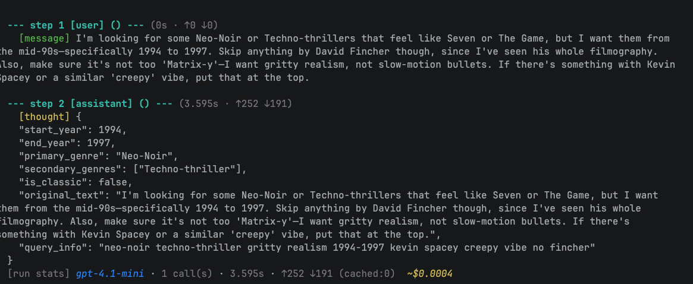
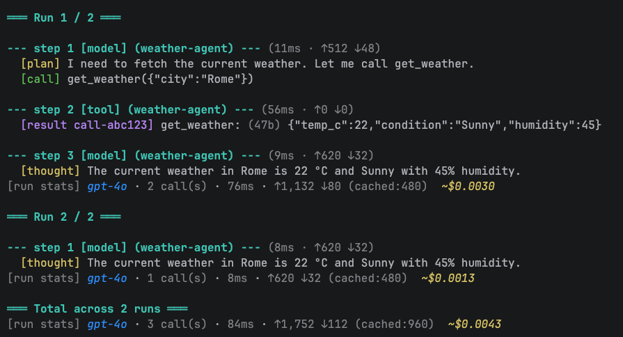

# agentmeter

A Go dev tool for inspecting and debugging LLM agent systems directly in your terminal.

When you're building multi-agent pipelines — planner, retriever, executor, whatever — things get hard to follow fast. `agentmeter` gives you a live, structured view of every step: which agent ran, what it said, what tools it called, how long it took, and what it cost. No dashboards, no cloud, no setup. Just your terminal.

It's framework-agnostic. The core has no SDK dependencies. An adapter for [Eino](#eino) is available as a separate module.

```
go get github.com/erlangb/agentmeter
```





---

## Quick start

```go
meter := agentmeter.New(pricing.WithDefaultPricing())
meter.Reset("run-1")

start := time.Now()
// ... model call ...
meter.Record(agentmeter.AgentStep{
    Role:      "model",
    Cluster:   agentmeter.ClusterCognitive,
    AgentName: "planner",
    ModelID:   "gpt-4o",
    StartedAt: start,
    Content:   "I'll search for recent Go releases.",
    Usage:     agentmeter.TokenUsage{PromptTokens: 200, CompletionTokens: 30},
})

start = time.Now()
// ... tool call ...
meter.Record(agentmeter.AgentStep{
    Role:      "tool",
    Cluster:   agentmeter.ClusterAction,
    AgentName: "executor",
    StartedAt: start,
    ToolName:  "web_search",
    Content:   "Go 1.23 was released in August 2024...",
})

meter.Finalize()

printer := reasoning.NewPrinter(os.Stdout)
printer.Print(meter.Snapshot())
```

---

## Adapters

Each adapter is a separate Go sub-module — pull in only what you need.

### Eino

```
go get github.com/erlangb/agentmeter/adapters/eino
```

```go
meter := agentmeter.New(pricing.WithDefaultPricing())
handler := einometer.NewAgentMeterHandler(meter)

runner, _ := graph.Compile(ctx, compose.WithGlobalCallbacks(handler))
runner.Invoke(ctx, "input")

printer.Print(meter.Snapshot())
```

Captures: chain start/end → `Reset`/`Finalize`, ChatModel output → `ClusterCognitive` step (with token usage, model ID, tool calls), ToolsNode output → `ClusterAction` steps, errors → `ClusterError`.

---

## Core concepts

### StepCluster

The fixed vocabulary that drives rendering and counters. Set it on every step.

| Constant | Use for | Effect |
|---|---|---|
| `ClusterCognitive` | Model inference, thinking | Increments `ModelCalls` |
| `ClusterAction` | Tool result | Rendered as a tool block |
| `ClusterMessage` | User-facing output | Rendered as a message |
| `ClusterError` | Failures, exceptions | Rendered in red |

`Role` is a free-form string you own. The library defines no role constants.

### Run label vs agent name

| Field | Scope | Set by |
|---|---|---|
| `Snapshot.Label` | The run | `meter.Reset(label)` |
| `AgentStep.AgentName` | Each step | You, in `Record()` |

`Label` groups the session. `AgentName` tells you which agent produced each step. Useful when planner, retriever, and executor all share one meter.

### Snapshot

`Snapshot()` returns an immutable, mutex-free copy of the current run — safe to log, marshal, or pass around.

```go
snap := meter.Snapshot()
snap.Label
snap.Steps                          // []AgentStep, chronological
snap.TokenSummary.ByModel           // token breakdown per model
snap.TokenSummary.EstimatedCostUSD
snap.TotalDuration
```

### History

`Finalize()` seals a run and appends it to a bounded history (default: 100 runs).

```go
history := meter.History() // []Snapshot
printer.PrintHistory(history)
```

---

## Pricing

```go
// Built-in table: OpenAI, Anthropic Claude, Google Gemini
meter := agentmeter.New(pricing.WithDefaultPricing())

// Or roll your own
meter := agentmeter.New(agentmeter.WithCostFunc(func(s agentmeter.TokenSummary) float64 {
    u := s.AggregateTokenUsage()
    return float64(u.PromptTokens)*0.000002 + float64(u.CompletionTokens)*0.000006
}))
```

Cost is computed lazily at `Snapshot()` time. See `pricing/pricing.go` for the full model list.

---

## Terminal output

```go
printer := reasoning.NewPrinter(os.Stdout)
printer.Print(snap)           // single run
printer.PrintHistory(history) // all runs with aggregate summary
```

---

## Examples

| Example | What it shows |
|---|---|
| `go run ./examples/basic/` | One run: model → tool → model |
| `go run ./examples/history/` | Multi-run history with aggregate cost |
| `go run ./examples/mixed_pricing/` | GPT-4o and Gemini in one run |
| `go run ./examples/custom_cost/` | Custom `CostFunc` |
| `go run ./examples/terminal_output/` | Coloured, plain, and custom terminal styles |

---

## Options

```go
meter := agentmeter.New(
    agentmeter.WithCostFunc(costFn),
    agentmeter.WithMaxHistory(50),
)
```

---

## Testing

```bash
go test -v -race ./...
go vet ./...

# eino adapter
cd adapters/eino && go test -v -race ./...
```
